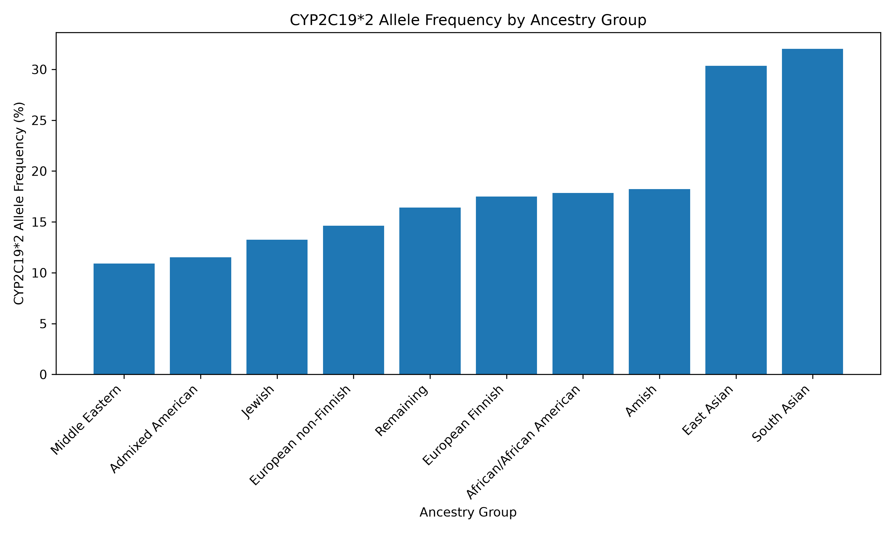
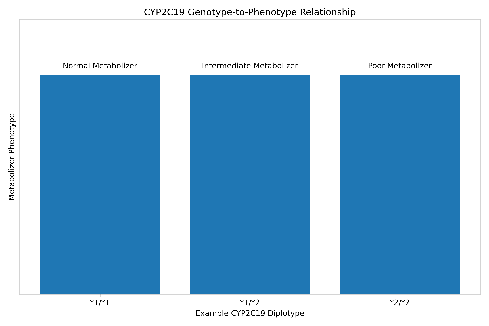

# CYP2C19 Pharmacogenomics Analysis

A reproducible Python-based pharmacogenomics project analyzing the CYP2C19*2 variant and its relationship to clopidogrel response.

## Project Overview

This project examines the pharmacogenomic relationship between the antiplatelet drug clopidogrel and the CYP2C19 gene, focusing on the CYP2C19*2 star allele (rs4244285).

The analysis integrates:

* Variant annotation and pharmacogenomic evidence from PharmGKB/ClinPGx
* Population allele-frequency data from gnomAD v4.1.1
* CYP2C19*2 genotype-to-phenotype relationships
* Clinical recommendations from CPIC
* Python-based data processing and visualization

The goal is to demonstrate a reproducible computational pharmacogenomics workflow using publicly available genomic and clinical resources.

## Drug-Gene Pair

| Field                     | Value            |
| ------------------------- | ---------------- |
| Drug                      | Clopidogrel      |
| Gene                      | CYP2C19          |
| Star allele               | *2               |
| Variant                   | rs4244285        |
| Molecular change          | c.681G>A         |
| Functional classification | No function      |
| Evidence source           | PharmGKB/ClinPGx |
| Evidence level            | 1A               |

CYP2C19*2 is a no-function allele associated with abnormal CYP2C19 splicing and reduced functional enzyme activity.

## Data Sources

### PharmGKB / ClinPGx

Pharmacogenomic evidence was used to identify the CYP2C19-clopidogrel relationship, the CYP2C19*2 allele, and its functional classification.

### gnomAD

Population-frequency data were obtained from gnomAD v4.1.1 using GRCh38 and combined Exomes + Genomes data.

The analyzed variant was:

```text
10-94781859-G-A
```

This variant corresponds to:

* rsID: rs4244285
* Gene: CYP2C19
* Star allele: *2
* Molecular change: c.681G>A
* Genome build: GRCh38
* gnomAD version: v4.1.1

Ten gnomAD ancestry groups were included in the population analysis.

### CPIC

CPIC guidance was used to examine the relationship between CYP2C19 genotype and predicted metabolizer phenotype, as well as clinical recommendations for clopidogrel use.

## Population Frequency Analysis

The CYP2C19*2 allele frequency varied across the analyzed gnomAD ancestry groups.

The observed frequencies ranged from:

* 10.90% in the Middle Eastern group
* 32.03% in the South Asian group

The mean allele frequency across the ten analyzed groups was approximately 18.26%.

These frequencies describe population-level genetic variation and should not be interpreted by themselves as measures of individual clinical risk.

### Population Frequency Figure



## CYP2C19 Genotype and Metabolizer Phenotype

The project includes representative CYP2C19 diplotypes:

| Diplotype | Predicted phenotype      |
| --------- | ------------------------ |
| *1/*1     | Normal Metabolizer       |
| *1/*2     | Intermediate Metabolizer |
| *2/*2     | Poor Metabolizer         |

Because CYP2C19*2 is a no-function allele, the number and combination of no-function alleles contribute to predicted phenotype.

### Genotype-to-Phenotype Figure



## Clinical Pharmacogenomics

CYP2C19 activity affects the bioactivation of clopidogrel.

Reduced CYP2C19 function can result in reduced formation of the active clopidogrel metabolite. CPIC recommendations distinguish clopidogrel use according to metabolizer phenotype and clinical context.

For selected cardiovascular indications, CPIC recommends considering alternative antiplatelet therapy for CYP2C19 intermediate and poor metabolizers when clinically appropriate and when no contraindications are present.

Clinical recommendations are included for pharmacogenomic analysis and educational purposes. Treatment decisions should follow current clinical guidelines and be made by qualified healthcare professionals.

## Integrated Analysis

The project combines variant-level, population-level, and clinical pharmacogenomic information into an integrated summary.

The resulting table is:

```text
data/processed/cyp2c19_integrated_summary.tsv
```

Conceptual workflow:

```text
CYP2C19*2
    ↓
rs4244285 / c.681G>A
    ↓
No-function allele
    ↓
CYP2C19 metabolizer phenotype
    ↓
Clopidogrel pharmacogenomic implications
```

## Project Structure

```text
pharmacogenomics-cyp2c19/
├── README.md
├── data/
│   ├── raw/
│   │   ├── cpic_cyp2c19_clopidogrel.tsv
│   │   ├── gnomad_cyp2c19_metadata.tsv
│   │   └── gnomad_cyp2c19_star2.tsv
│   └── processed/
│       ├── cpic_cyp2c19_clopidogrel.tsv
│       ├── cyp2c19_integrated_summary.tsv
│       ├── cyp2c19_population_frequencies.tsv
│       └── cyp2c19_variant_metadata.tsv
├── results/
│   ├── figures/
│   │   ├── cpic_genotype_phenotype.png
│   │   └── cyp2c19_star2_population_frequency.png
│   └── tables/
└── scripts/
    ├── 01_variant_metadata.py
    ├── 02_population_frequencies.py
    ├── 03_population_frequency_plot.py
    ├── 04_cpic_analysis.py
    ├── 05_cpic_phenotype_plot.py
    └── 06_integrated_analysis.py
```

## Reproducibility

The analysis was implemented in Python 3.11 using:

* pandas
* NumPy
* Matplotlib

All six analysis scripts can be executed from the project root:

```bash
python scripts/01_variant_metadata.py
python scripts/02_population_frequencies.py
python scripts/03_population_frequency_plot.py
python scripts/04_cpic_analysis.py
python scripts/05_cpic_phenotype_plot.py
python scripts/06_integrated_analysis.py
```

The scripts read the project data files, perform the analyses, generate processed tables and figures, and save the resulting outputs to the project directories.

## Key Findings

1. CYP2C19*2 (rs4244285; c.681G>A) is classified as a no-function CYP2C19 allele.
2. The variant was observed across all ten analyzed gnomAD ancestry groups.
3. The observed allele frequency ranged from 10.90% to 32.03% across these groups.
4. Representative CYP2C19 diplotypes containing no-function alleles can correspond to intermediate or poor metabolizer phenotypes.
5. CPIC provides phenotype-specific recommendations for clopidogrel based on CYP2C19 metabolizer status and clinical context.

## Limitations

* The analysis focuses on one CYP2C19 variant rather than the complete spectrum of CYP2C19 genetic variation.
* Population allele frequencies do not directly predict individual clinical outcomes.
* gnomAD ancestry categories do not represent every global population.
* The CPIC dataset included in this project represents selected genotype-to-phenotype relationships and clinical recommendations rather than the complete guideline.
* The project uses manually curated source data files rather than automated live database queries.

## Future Extensions

Potential future extensions include:

* Addition of CYP2C19*3 and *17
* Inclusion of additional CYP2C19 variants
* Automated retrieval through database APIs
* Automated metabolizer phenotype prediction
* Expanded population analyses
* Integration of additional pharmacogenomic databases
* Analysis of additional pharmacogene-drug pairs
* Interactive pharmacogenomic visualizations

## References and Primary Data Resources

The project is based on the following primary resources:

1. PharmGKB / ClinPGx
   Pharmacogenomic annotations and evidence for CYP2C19 and clopidogrel.

2. gnomAD v4.1.1
   Population allele-frequency data for rs4244285 using GRCh38 and combined Exomes + Genomes data.

3. CPIC
   Clinical Pharmacogenetics Implementation Consortium guideline for CYP2C19 genotype-guided clopidogrel therapy.

4. NCBI ClinVar
   Variant-level information for rs4244285 and CYP2C19*2.

## Disclaimer

This project is intended for educational and computational research purposes only. It does not provide individualized medical advice or treatment recommendations.

